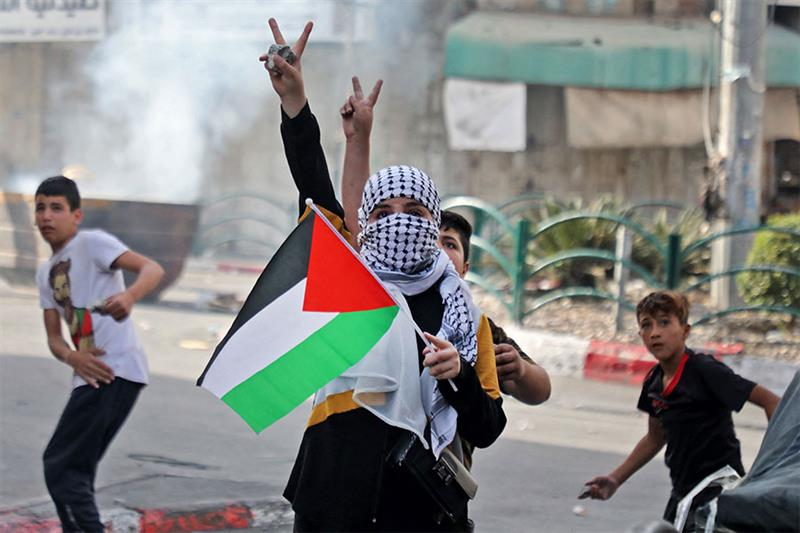
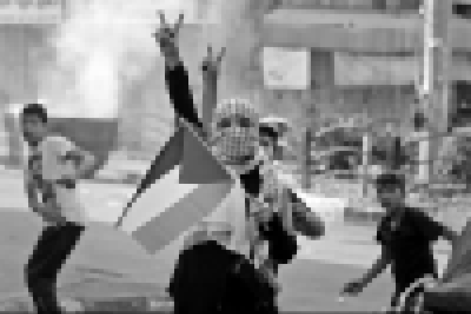

# 🖼️ JPEG Image Coding & Convolutional Channel Coding in Python

## 📚 Table of Contents

- [🌍 Overview](#-overview)
- [✨ Features](#-features)
- [🧩 Project Parts](#-project-parts)
  - [📦 Part 1 – JPEG Encoder and Decoder (Source Coding)](#-part-1--jpeg-encoder-and-decoder-source-coding)
    - [Step 1 – 8×8 Block Partitioning](#step-1--88-block-partitioning)
    - [Step 2 – Custom 2D DCT](#step-2--custom-2d-dct)
    - [Step 3 – Quantization with Multiple Tables](#step-3--quantization-with-multiple-tables)
    - [Step 4 – Zig-Zag Scan (2D → 1D)](#step-4--zig-zag-scan-2d--1d)
    - [Step 5 – Run-Length Encoding of Zeros](#step-5--run-length-encoding-of-zeros)
    - [Step 6 – Huffman & Finite-Precision Arithmetic Encoding](#step-6--huffman--finite-precision-arithmetic-encoding)
    - [Decoder Pipeline (Steps 7–13)](#decoder-pipeline-steps-7-13)
  - [📡 Part 2 – Convolutional Coding & AWGN Channel](#-part-2--convolutional-coding--awgn-channel)
    - [Step 1 – Convolutional Encoder Design (Rate 1/3, K = 3)](#step-1--convolutional-encoder-design-rate-13-k--3)
    - [Step 2 – Software Implementation of the Encoder](#step-2--software-implementation-of-the-encoder)
    - [Step 3 – Blockwise Processing and Zero-Tail Termination](#step-3--blockwise-processing-and-zero-tail-termination)
    - [Step 4 – BPSK Modulation and AWGN Channel](#step-4--bpsk-modulation-and-awgn-channel)
    - [Step 5 – Hard-Decision Viterbi Decoder](#step-5--hard-decision-viterbi-decoder)
    - [Step 6 – BER vs SNR Performance Evaluation](#step-6--ber-vs-snr-performance-evaluation)
    - [Step 7 – End-to-End Integration with JPEG](#step-7--end-to-end-integration-with-jpeg)
- [📊 Output & Results](#-output--results)
  - [BER vs SNR Curve](#ber-vs-snr-curve)
  - [JPEG Reconstruction Examples](#jpeg-reconstruction-examples)
- [📄 License](#-license)

---

## 🌍 Overview

This project implements a **JPEG-like image compression scheme** and a **convolutional channel coding system** entirely in **Python**, without using built-in JPEG or convolutional-coding libraries.

- **Part 1 – JPEG Encoder/Decoder:**  
  A custom grayscale JPEG-style codec is implemented for 8-bit images:
  - Block-based 2D DCT (coded from scratch),
  - Quantization using multiple 8×8 tables,
  - Zig-zag scanning, run-length encoding,
  - Huffman coding and finite-precision arithmetic coding,
  - Full decoder pipeline and visual comparison for each quantization table.

- **Part 2 – Channel Coding over AWGN:**  
  A **rate 1/3 convolutional encoder** (constraint length \(K = 3\)) and **hard-decision Viterbi decoder** are implemented, integrated with BPSK modulation over an **AWGN channel**. The JPEG bitstream from Part 1 is protected with this code to build a complete **source + channel coding communication system**.

All demonstrations and plots (BER vs SNR, reconstructed images) are generated in Python.

---

## ✨ Features

- ✅ Custom JPEG-like encoder/decoder for 8-bit grayscale images.
- ✅ Pure-Python implementation of:
  - 2D DCT and IDCT for 8×8 blocks,
  - Run-length encoder/decoder,
  - Huffman encoder/decoder,
  - Finite-precision arithmetic encoder/decoder.
- ✅ Multiple quantization tables for **high** vs **low** compression.
- ✅ Rate 1/3 convolutional encoder (\(K = 3\)) and hard-decision Viterbi decoder.
- ✅ End-to-end **BPSK + AWGN + channel decoding + JPEG decoding**.
- ✅ BER vs SNR analysis **with and without coding**.
- ✅ Visual comparison of:
  - Original color image,
  - Transmitted grayscale image,
  - Received & decoded images under high and low compression.

All assets (plots and images) are stored in the `Assets/` folder.

---

## 🧩 Project Parts

---

### 📦 Part 1 – JPEG Encoder and Decoder (Source Coding)

This part develops a JPEG-style encoder and decoder **from scratch** for any 8-bit grayscale image.

#### Step 1 – 8×8 Block Partitioning

1. Load the input image (originally colored, then converted to grayscale).
2. Ensure the grayscale image values are in the range \([0, 255]\) (8-bit).
3. Optionally subtract 128 from each pixel to center values around 0.
4. Divide the image into **non-overlapping 8×8 blocks**; pad the image if its size is not a multiple of 8.

> Implementation detail: a simple nested loop or vectorized reshape is used to extract 8×8 tiles.

---

#### Step 2 – Custom 2D DCT

The 2D DCT for each 8×8 block is implemented manually, without using built-in DCT libraries.

For an \(8 \times 8\) block \(f[x, y]\), the DCT coefficient \(F[u, v]\) is computed using separable **1D basis functions**:

\[
b_x[x, u] = \cos\left(\frac{(2x + 1)u\pi}{16}\right), \quad
b_y[y, v] = \cos\left(\frac{(2y + 1)v\pi}{16}\right)
\]

\[
F[u, v] = \alpha(u)\alpha(v)
\sum_{x=0}^{7} \sum_{y=0}^{7}
f[x, y]\;
b_x[x,u]\; b_y[y,v]
\]

where \(\alpha(u)\) and \(\alpha(v)\) are the usual DCT scaling factors.

Additional implementation notes (as in the project statement):

- The DC coefficient at \((u=0, v=0)\) is scaled appropriately (e.g., divided by 64).
- Coefficients with either \(u = 0\) or \(v = 0\) (excluding \((0,0)\)) are scaled differently.
- Remaining coefficients are scaled by another factor (e.g., 16) to ensure that IDCT reconstructs the original pixels exactly for a test block.

The **inverse DCT (IDCT)** is implemented with the same basis functions in reverse, guaranteeing that an 8×8 block passes a DCT→IDCT cycle without loss (before quantization).

---

#### Step 3 – Quantization with Multiple Tables

For each 8×8 DCT block:

1. Two (or more) **quantization matrices** \(Q^{(1)}\) and \(Q^{(2)}\) are defined:
   - One corresponding to **high compression** (larger values, more aggressive quantization),
   - One corresponding to **low compression** (smaller values, better quality).

2. Each DCT coefficient is quantized as:

\[
C_q^{(k)}[u,v] = \text{round}\left(\frac{F[u,v]}{Q^{(k)}[u,v]}\right)
\]

3. The encoder can be run separately for each table to compare rate–distortion performance.

---

#### Step 4 – Zig-Zag Scan (2D → 1D)

Each \(8 \times 8\) quantized block is converted into a **1D vector of length 64** using the standard JPEG **zig-zag pattern** (diagonal scan from DC to higher frequencies).

- This step groups low-frequency coefficients at the start and high-frequency coefficients at the end.
- After heavy quantization, the tail of the vector often consists of many zeros.

> Implementation detail: a precomputed list of (row, column) indices is used to map 2D positions into 1D order.

---

#### Step 5 – Run-Length Encoding of Zeros

The 1D coefficient vectors (per block) are then fed into a **run-length encoder (RLE)**:

- Sequences of trailing zeros are represented by `(RUN, VALUE)` or similar schemes.
- Nonzero coefficients are encoded along with the number of preceding zeros.
- Special end-of-block symbols may be used when the rest of the 64-element block is all zeros.

This step greatly compresses the high-frequency zero sequences produced by quantization.

---

#### Step 6 – Huffman & Finite-Precision Arithmetic Encoding

Two entropy coding methods are implemented **from scratch**:

1. **Huffman Encoder**
   - Symbol probabilities are estimated from the run-length output.
   - A binary tree is built, and each symbol is assigned a variable-length code.
   - The run-length stream is converted into a binary bitstream using the Huffman codes.

2. **Finite-Precision Arithmetic Encoder**
   - The same symbol alphabet is used.
   - An interval \([0,1)\) is recursively narrowed based on cumulative probabilities.
   - All computations are implemented with **finite precision** (e.g., integer arithmetic and renormalization) to avoid floating-point issues.

The project **compares**:
- Compression ratio,
- Bitrate,
- Complexity/latency  
between **Huffman coding** and **arithmetic coding** when used as the entropy coder in the JPEG pipeline.

---

#### Decoder Pipeline (Steps 7–13)

The JPEG decoder reverses all previous steps:

7. **Huffman / Arithmetic Decoding**  
   - Decode the compressed bitstream using the corresponding entropy decoder, reconstructing the run-length coded symbol sequence.

8. **Run-Length Decoding**  
   - Expand run-length codes back to sequences of 64 coefficients per block (in zig-zag order), re-introducing explicit zeros.

9. **1D → 8×8 Block Reconstruction**  
   - Map each 64-entry vector back into an 8×8 array using the inverse zig-zag pattern.

10. **De-Quantization**  
    - Multiply each coefficient by the corresponding quantization matrix element:

\[
\hat{F}[u,v] = C_q[u,v] \cdot Q[u,v]
\]

11. **Inverse DCT (IDCT)**  
    - Apply the custom 2D IDCT to each 8×8 de-quantized block to obtain spatial pixel values.

12. **Reconstruct the Full Image**  
    - Assemble all 8×8 blocks into the full image frame.
    - Clip values to \([0,255]\) and cast back to 8-bit integers.

13. **Quality Comparison**  
    - Compare the original grayscale image with:
      - The reconstructed image using the **low-compression** quantization table.
      - The reconstructed image using the **high-compression** quantization table.
    - Compute PSNR / MSE and visually inspect the images.

---

### 📡 Part 2 – Convolutional Coding & AWGN Channel

In Part 2, a **rate 1/3 convolutional code** is designed and used to protect the JPEG bitstream over an AWGN channel.

#### Step 1 – Convolutional Encoder Design (Rate 1/3, K = 3)

- Constraint length: \(K = 3\), so the shift register has \(K-1 = 2\) memory elements.
- Code rate: \(R = 1/3\) → for each input bit, **three output bits** are generated.
- Three generator polynomials (in octal or binary) are chosen, for example:
  - \(g_1 = 7_8\), \(g_2 = 5_8\), \(g_3 = 3_8\)   (just as an example; actual choice is configurable).
- The encoder structure is implemented using:
  - A shift register,
  - XOR operations corresponding to each generator polynomial.

---

#### Step 2 – Software Implementation of the Encoder

- Implemented in pure Python (no built-in comms library).
- Given an input bitstream \(u[n]\), the encoder updates the register and outputs three coded bits per symbol.
- The implementation supports:
  - Arbitrary block lengths,
  - Easy reset of the encoder state.

---

#### Step 3 – Blockwise Processing and Zero-Tail Termination

Because the JPEG bitstream is long, it is split into **blocks**:

1. The input bitstream is divided into smaller blocks.
2. Each block is encoded individually.
3. At the end of each block, a specific number of **zero bits** is appended to flush the encoder back to the **all-zeros state** (zero-tailing).
4. The decoder performs the same block segmentation and assumes the encoder resets between blocks.

This approach simplifies Viterbi decoding and avoids path-memory ambiguity across blocks.

---

#### Step 4 – BPSK Modulation and AWGN Channel

- Each coded bit is mapped to a BPSK symbol:
  - Bit 0 → \(+1\)
  - Bit 1 → \(-1\)
- AWGN noise \(n \sim \mathcal{N}(0, \sigma^2)\) is added to each symbol, where \(\sigma^2\) is chosen based on the desired **SNR (in dB)**.
- The received sample is:

\[
y = x + n
\]

where \(x\) is the transmitted BPSK symbol.

---

#### Step 5 – Hard-Decision Viterbi Decoder

A **hard-decision Viterbi decoder** is implemented from scratch:

1. **Hard Decision:**  
   - The receiver quantizes each noisy BPSK symbol into a binary decision:
     - \(y \geq 0 \Rightarrow \hat{b} = 0\),
     - \(y < 0 \Rightarrow \hat{b} = 1\).

2. **Trellis Construction:**  
   - Trellis states correspond to the contents of the shift register (4 states for \(K=3\)).
   - For each state and input bit, the next state and encoded output are defined by the generator polynomials.

3. **Path Metric Update:**  
   - At each time step, incoming branches are evaluated based on **Hamming distance** between expected code bits and received hard bits.
   - The survivor path with the minimum accumulated metric is stored.

4. **Traceback:**  
   - After processing all bits in a block, a traceback through the trellis is performed to reconstruct the most likely input bit sequence.
   - Zero-tailing ensures that the path ends in the all-zeros state.

---

#### Step 6 – BER vs SNR Performance Evaluation

Two systems are simulated:

1. **Source Encoded Only (No Channel Coding)**
   - JPEG bitstream is transmitted over BPSK + AWGN **without** convolutional coding.
   - Hard decisions directly produce the received bitstream.

2. **Channel Encoded (With Convolutional Code)**
   - JPEG bitstream is convolutionally encoded, BPSK-modulated, passed through AWGN, and decoded with the Viterbi algorithm.

For each SNR value:

- Bit-error rate (BER) is computed as:

\[
\text{BER} = \frac{\text{number of bit errors}}{\text{total transmitted bits}}
\]

- BER vs SNR curves are generated for:
  - **Source Encoded** (no channel code),
  - **Channel Encoded** (with convolutional code).

---

#### Step 7 – End-to-End Integration with JPEG

Finally, Part 1 and Part 2 are integrated to build a complete **digital communication chain**:

1. **Source Encoding (JPEG)**
   - Original grayscale image → JPEG encoder → compressed bitstream (high or low compression).

2. **Channel Encoding**
   - JPEG bitstream → convolutional encoder → BPSK + AWGN → Viterbi decoder.

3. **Source Decoding (JPEG)**
   - Recovered bitstream → JPEG decoder → reconstructed grayscale image.

4. **Comparison at Different SNRs**
   - For at least three SNR values, images are reconstructed:
     - **With channel coding**,  
     - **Without channel coding** (direct noisy bits into JPEG decoder).
   - Visual and quantitative comparison highlights:
     - The impact of noise on the image,
     - The improvement gained from channel coding,
     - The effect of high vs low compression quantization tables.

---

## 📊 Output & Results

All result figures are stored in the `Assets/` folder.

### BER vs SNR Curve

- The **blue curve** corresponds to the **Channel Encoded** system (with convolutional coding).
- The **orange curve** corresponds to the **Source Encoded** system (JPEG only, no channel code).
- As SNR increases (moving right), both BERs drop; however:
  - The channel-coded system achieves **much lower BER** at the same SNR.
  - For a given target BER (e.g., \(10^{-3}\)), the channel-coded system requires **several dB less SNR**, illustrating the coding gain of the convolutional code.

---

### JPEG Reconstruction Examples

All example images are stored under `Assets/`:

- `Assets/palestine.jpg` – Original **color** image.
- `Assets/palestine_gray.jpg` – Original **grayscale** image used for JPEG + transmission.
- `Assets/HIGH.jpg` – Received and decoded image with **high compression**.
- `Assets/LOW.jpg` – Received and decoded image with **low compression**.

**Side-by-side comparison:**

| Original Color Image | Grayscale (Transmitted) | Received – High Compression | Received – Low Compression |
| -------------------- | ----------------------- | --------------------------- | -------------------------- |
|  |  |  |  |

- The **grayscale image** is the version actually encoded by the JPEG pipeline and transmitted through the channel.
- The **high-compression** image shows stronger blocking artifacts and loss of fine detail but uses fewer bits.
- The **low-compression** image preserves more details and exhibits fewer visible artifacts at the cost of a higher bitrate.
- At sufficiently high SNR with channel coding enabled, the reconstructed images are very close to their respective JPEG-only outputs, showing that most residual distortion is due to compression rather than channel errors.

---

## 📄 License

⚠️ **Important Notice:** This repository is publicly available for viewing only. Forking, cloning, or redistributing this project is **NOT** permitted without explicit permission.

Copyright (c) 2025 Chameleon Tech
